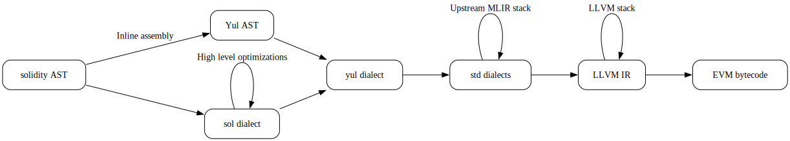

# Phases



## Example of Lowering

The AST is the in-memory representation of the source code. Let us take the
following example and see how it is progressively lowered.

```solidity
contract C {
  uint m;
  constructor (uint a) { m = a; }
  function f(uint a) public returns (uint[5] memory) {
    uint[5] memory ret;
    for (uint i = 0; i < 5; ++i)
      ret[i] = a + i;
    return ret;
  }
}
```

The sol dialect is the high-level dialect that represents solidity in SSA form,
with minimal EVM details. Here is a shortened version of the sol dialect
representation:

```mlir
module attributes {sol.evm_version = #Prague} {
  sol.contract @C_51 {
    sol.state_var @m_2 : ui256
    sol.func @_12(%arg0: ui256) attributes {kind = #Constructor, orig_fn_type = (ui256) -> (), state_mutability = #NonPayable} {
      %1 = sol.addr_of @m_2 : !sol.ptr<ui256, Storage>
      sol.store %arg0, %1 : ui256, !sol.ptr<ui256, Storage>
      sol.return
    }
    sol.func @f_50(%arg0: ui256) -> !sol.array<5 x ui256, Memory> attributes {orig_fn_type = (ui256) -> !sol.array<5 x ui256, Memory>, selector = -1277270901 : i32, state_mutability = #NonPayable} {
      ...
      %1 = sol.alloca : !sol.ptr<!sol.array<5 x ui256, Memory>, Stack> // Tracks the array
      %2 = sol.malloc zero_init :  !sol.array<5 x ui256, Memory> // Allocate array on memory
      sol.store %2, %1 : !sol.array<5 x ui256, Memory>, !sol.ptr<!sol.array<5 x ui256, Memory>, Stack>
      ...
      sol.for cond {
        ...
        %6 = sol.cmp lt, %5, %c5_ui256 : ui256 // i < 5
        sol.condition %6
      } body {
        %7 = sol.gep ... // Array address calculation
        %10 = sol.cadd %8, %9 : ui256 // Checked add
        sol.store %10, %7 : ui256, !sol.ptr<ui256, Memory>
        sol.yield
      } step {
        ...
      }
      %4 = sol.load %1 ...
      sol.return %4 : !sol.array<5 x ui256, Memory>
    }
  }
}
```

Notice that things like memory allocation, checked addition, and structured
control flow are not expanded. There is no offset-64 manipulation, no revert
code generation when an addition overflows, etc. This allows us to analyze
higher-level aspects such as tracking the lifetime of memory allocations
(see https://github.com/matter-labs/era-solidity/blob/mlir/docs/internals/mlir/lifetime.rst),
or optimizing checked arithmetic
(see https://github.com/matter-labs/era-solidity/blob/mlir/docs/internals/mlir/checked-arith.rst).

Then we lower to the Yul dialect, which is more or less the same Yul
representation you would get from upstream solc with the options --ir or
--ir-optimized when using --via-ir.

```mlir
sol.object @C_51 {
  ...
  sol.mstore %c64_i256, %c128_i256
  ...
  sol.call @_12(%10) : (i256) -> ()
  ...
  %12 = sol.mload %c64_i256_3
  %13 = sol.dataoffset {obj = @C_51_deployed}
  %14 = sol.datasize {obj = @C_51_deployed}
  sol.codecopy %12, %13, %14
  sol.builtin_ret %12, %14
  sol.func @_12(%arg0: i256) attributes {kind = #sol<FunctionKind Constructor>, orig_fn_type = (ui256) -> (), state_mutability = #sol<StateMutability NonPayable>} {
    ...
    sol.sstore %c0_i256_4, ...
    sol.return
  }

  sol.object @C_51_deployed {
      %17 = sol.calldataload %c0_i256_8
      %18 = arith.shrui %17, %c224_i256 : i256
      ...
      scf.int_switch %19 : i32
      case -1277270901 {
        ...
        %26 = sol.call @f_50(%24) : (i256) -> i256
        ...
      }
      default {
        scf.yield
      }
    sol.func @f_50(%arg0: i256) -> i256 attributes {orig_fn_type = (ui256) -> !sol.array<5 x ui256, Memory>, runtime, selector = -1277270901 : i32, state_mutability = #sol<StateMutability NonPayable>} {
      ...
    }
  }
}
```

Currently the yul ops are still part of the sol dialect, but they will
soon be moved into a separate "yul" dialect. We have not planned any
optimizations at this stage, since most low-level optimizations are handled in
LLVM. In the future, however, we can replicate any via-IR optimizations if LLVM
does not cover them.

Then we lower to the standard MLIR dialects, which are maintained upstream in
MLIR, and finally to LLVM IR:

```llvm
; Creation
; --------
target datalayout = "E-p:256:256-i256:256:256-S256-a:256:256"
target triple = "evm-unknown-unknown"

define void @__entry() local_unnamed_addr #0 !dbg !3 {
  ...
  %13 = tail call i256 @llvm.evm.dataoffset(metadata !12), !dbg !6
  %16 = inttoptr i256 %13 to ptr addrspace(4), !dbg !6
  tail call void @llvm.memcpy.p1.p4.i256(ptr addrspace(1) align 1 %15, ptr addrspace(4) align 1 %16, i256 %14, i1 false), !dbg !6
  tail call void @llvm.evm.return(ptr addrspace(1) %15, i256 %14), !dbg !6
}


; Runtime
; -------
target datalayout = "E-p:256:256-i256:256:256-S256-a:256:256"
target triple = "evm-unknown-unknown"

define void @__entry() local_unnamed_addr #0 !dbg !3 {
  %4 = load i256, ptr addrspace(2) null, align 1, !dbg !9
  %5 = lshr i256 %4, 224, !dbg !9
  %6 = trunc i256 %5 to i32, !dbg !9
  switch i32 %6, label %33 [
    i32 -1277270901, label %7
  ], !dbg !9
  ...
}
```

# Compile Time

## Serial compilation

The AST lowering, MLIR, and LLVM phases are directly integrated with solc. This
lets us leverage LLVM's optimized pipeline without forking a new process. We
see measurable improvements in single-threaded compile time compared to solc
via-IR in our semantic test suite:

```
Comparing compile times:
  us-solc  : us-solc --via-ir --asm --optimize <file>
  solc-mlir: solc --mlir-target=evm --mlir-action=print-asm --mlir-opt=3 <file>
  iterations: 20

File                 |    us-solc (s) |  solc-mlir (s) |     Difference |   Percent
-------------------------------------------------------------------------------------
abi.sol              |         0.0312 |         0.0279 |        -0.0033 |    10.55%
aggr.sol             |         0.1955 |         0.0719 |        -0.1236 |    63.22%
arith.sol            |         0.0484 |         0.0286 |        -0.0199 |    40.99%
bytes.sol            |         0.0387 |         0.0278 |        -0.0109 |    28.27%
cf.sol               |         0.0204 |         0.0218 |         0.0015 |    -7.18%
ctor-2.sol           |         0.0549 |         0.0202 |        -0.0347 |    63.15%
ctor.sol             |         0.0491 |         0.0230 |        -0.0261 |    53.15%
erc20.sol            |         0.0655 |         0.0316 |        -0.0340 |    51.85%
event.sol            |         0.0126 |         0.0167 |         0.0041 |   -32.61%
fn.sol               |         0.0520 |         0.0220 |        -0.0300 |    57.66%
getter.sol           |         0.0571 |         0.0205 |        -0.0366 |    64.06%
inheritance-2.sol    |         0.0290 |         0.0169 |        -0.0121 |    41.60%
inheritance-3.sol    |         0.0171 |         0.0151 |        -0.0020 |    11.50%
inheritance.sol      |         0.0196 |         0.0157 |        -0.0038 |    19.67%
inline-asm.sol       |         0.0094 |         0.0165 |         0.0071 |   -75.11%
invalid-abi.sol      |         0.0519 |         0.0347 |        -0.0172 |    33.12%
modifier.sol         |         0.0169 |         0.0182 |         0.0013 |    -7.68%
require.sol          |         0.0156 |         0.0180 |         0.0024 |   -15.29%
state-var.sol        |         0.0181 |         0.0166 |        -0.0015 |     8.25%
storage-array.sol    |         0.0898 |         0.0309 |        -0.0589 |    65.60%
try.sol              |         0.0453 |         0.0241 |        -0.0212 |    46.85%
```

We will soon investigate the 32% slowdown in event.sol and the 75% slowdown in
inline-asm.sol.

## Parallel Compilation

The full lowering from AST is parallelized on a per-contract basis. For example,
on a Dell XPS 15 9520 with an Intel i7-12700H, an artificial setup with 14 ERC20
contracts can be compiled in:

```
real    0m0.080s
user    0m0.480s
sys     0m0.032s
```

while upstream solc takes:

```
real    0m0.872s
user    0m0.863s
sys     0m0.004s
```

# Status

All issues are tracked in
https://github.com/matter-labs/era-solidity/issues?q=is%3Aissue%20state%3Aopen%20label%3Amlir

The following summarizes the current state of solc-mlir:

## Supported
- Contracts, state variables and constructors
- Inheritance (testing)
- Interface, free and private functions
- Modifiers
- Control flow statements
- Integer type and arithmetic statements
- String, array, mapping and struct type
- Tuples
- Inline assembly (testing)
- Try statement
- Events
- Require statement
- Basic yul builtins like memory, storage, calldata, returndata, keccack256,
  logging, revert builtins

## Not yet supported
- Function pointer
- More yul builtins
- Array slices and index range
- More magic variables like tx, block etc.
- Enums
- Libraries
- Fixed point type
- String literals
